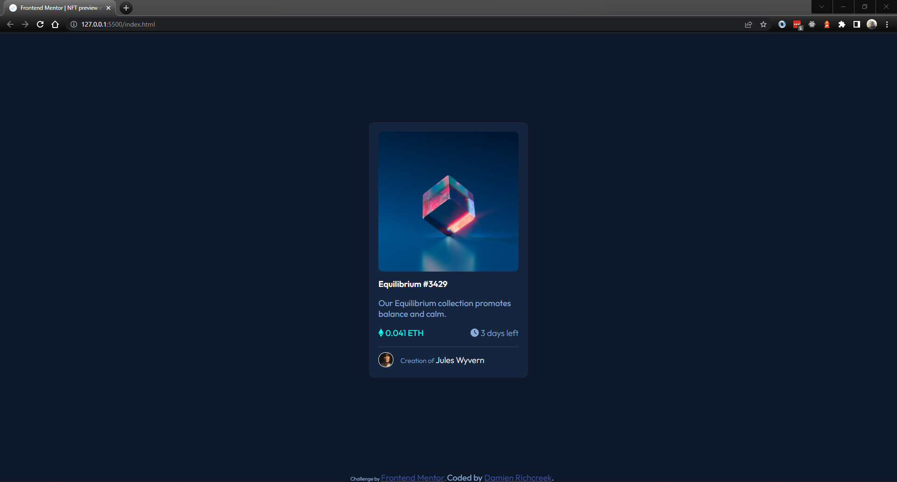

# Frontend Mentor - NFT preview card component solution

This is a solution to the [NFT preview card component challenge on Frontend Mentor](https://www.frontendmentor.io/challenges/nft-preview-card-component-SbdUL_w0U). Frontend Mentor challenges help you improve your coding skills by building realistic projects. 

## Table of contents

- [Frontend Mentor - NFT preview card component solution](#frontend-mentor---nft-preview-card-component-solution)
  - [Table of contents](#table-of-contents)
  - [Overview](#overview)
    - [The challenge](#the-challenge)
    - [Screenshot](#screenshot)
    - [Links](#links)
  - [My process](#my-process)
    - [Built with](#built-with)
    - [What I learned](#what-i-learned)
    - [Continued development](#continued-development)
  - [Author](#author)

## Overview

### The challenge

Users should be able to:

- View the optimal layout depending on their device's screen size
- See hover states for interactive elements

### Screenshot



### Links

- Solution URL: [FrontendMentor.io/Tactika](https://www.frontendmentor.io/solutions/project-nft-HywSGTzV5)
- GitHub URL: [GitHub.com/Tactika](https://github.com/Tactika/nft-preview-card-component)
- Live Site URL: [project-nft.projektz.dev](https://project-nft.projektz.dev)

## My process

### Built with

- Semantic HTML5 markup
- CSS custom properties
- Flexbox

### What I learned

This project I was able to learned more about the background-blend-mode in CSS, which frustrated me starting off, but then became more understandible once I was able to mess around with it.

```css
#overlay:hover {
  cursor: pointer;
  background-color: hsla(178, 100%, 50%, 0.5);
  background-blend-mode: overlay;
}
```

### Continued development

I realized with this project that I could use more experience creating more streamlined CSS. I want to continue building more projects and honing my skills.

## Author

- Website - [www.richcreek.dev](https://www.richcreek.dev)
- Frontend Mentor - [@Tactika](https://www.frontendmentor.io/profile/Tactika)
- Twitter - [@etactix](https://www.twitter.com/etactix)
